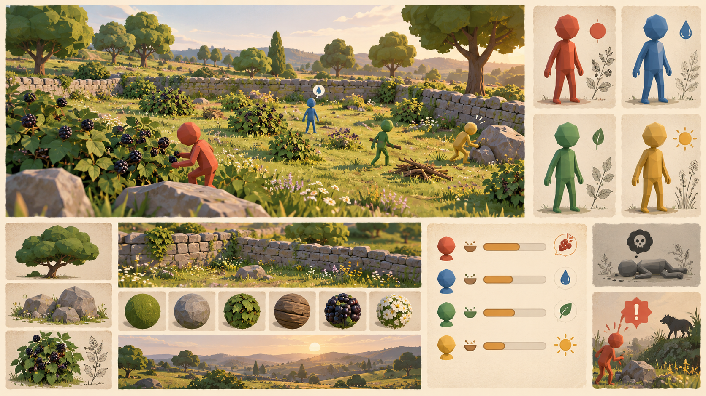
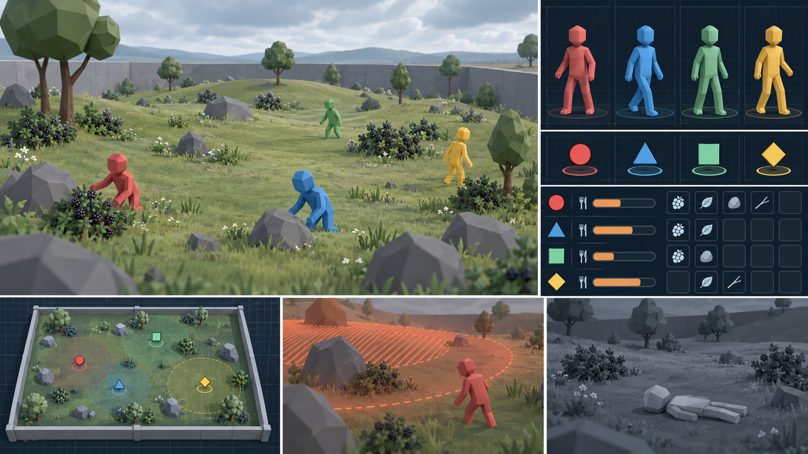
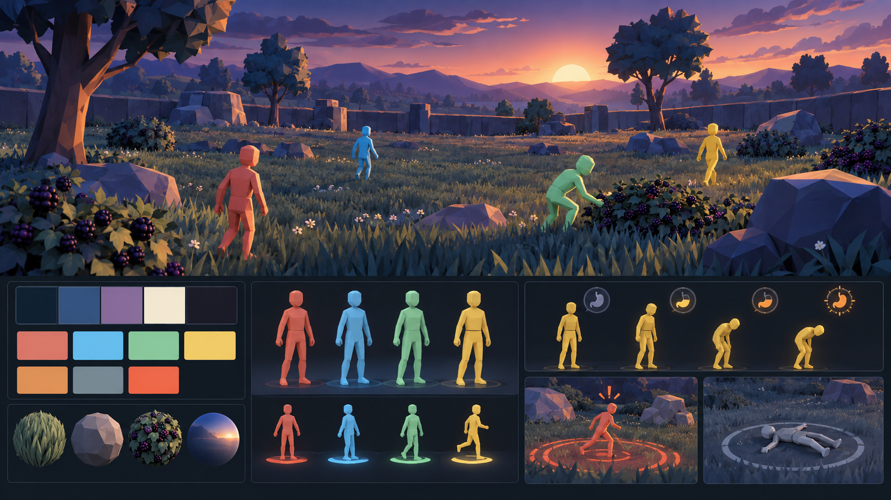

# Trois chartes visuelles proposées — IA_Life

Statut : pistes de conception, aucune intégration au jeu. Les moodboards sont des intentions visuelles générées, pas des captures du rendu Godot.

## A — Herbier vivant

Intention : donner à l'observation des agents l'allure d'un carnet naturaliste. Lumière chaude, végétation mate, interface ivoire et vert pin. Convient si le jeu doit paraître accueillant et organique.

| Usage | Couleur |
|---|---|
| Fond UI | ivoire `#F4EEDD` |
| Texte et contours | vert pin `#263D30` |
| Terrain secondaire | prairie `#6F8D5E` |
| Mûres / accents sombres | prune `#282033` |
| Agents Rouge / Bleu / Vert / Jaune | `#C65A45` / `#4D86B7` / `#5C9A67` / `#D9AA3C` |
| Faim / Mort / Danger | `#D58532` / `#727B78` / `#C94E43` |

Typographie : **Fraunces** en titres courts, **Atkinson Hyperlegible** pour commandes, statistiques et légendes. Titres sobres ; chiffres jamais en Fraunces.

États : faim par jauge ambrée décroissante et pictogramme de repas ; mort par silhouette gris ardoise et pictogramme explicite ; danger par bordure corail hachurée et signe d'alerte. Les quatre agents gardent leur nom et un repère distinct en plus de la couleur.

Point faible : les tons naturels proches du vert peuvent réduire la visibilité de l'agent Vert ; contour sombre et repère permanent nécessaires.

## B — Observatoire

Intention : séparer clairement le monde simulé de son instrument de lecture. Paysage neutre, interface sombre et structurée, repères géométriques. C'est la piste la plus adaptée à l'analyse comparative des comportements.

| Usage | Couleur |
|---|---|
| Fond UI | bleu nuit `#101D2B` |
| Texte | blanc froid `#EFF4F2` |
| Secondaire | ardoise `#647C87` |
| Accent neutre | cyan pâle `#A9D8DE` |
| Agents Rouge / Bleu / Vert / Jaune | `#D75B58` / `#4698D2` / `#65B977` / `#E4BE4B` |
| Faim / Mort / Danger | `#E5A543` / `#808B96` / `#EB694F` |

Typographie : **IBM Plex Sans** pour l'interface, **IBM Plex Mono** seulement pour mesures, horodatages et identifiants.

États : faim par jauge ambrée graduée ; mort par silhouette grise et statut textuel ; danger par contour orange rouge hachuré, visible aussi sur la vue de dessus. Repères d'agents : cercle, triangle, carré, losange, toujours associés au nom.

Point faible : une interface trop dense masquerait l'observation ; limiter les panneaux permanents et réserver les détails à l'inspecteur.

## C — Crépuscule lumineux

Intention : donner davantage de présence émotionnelle aux agents. Ciel de fin de journée, environnement bleu violet, touches chaudes sur les sujets. Convient si l'expérience de jeu prime sur la neutralité expérimentale.

| Usage | Couleur |
|---|---|
| Fond UI | bleu nuit `#142232` |
| Ciel / panneaux secondaires | bleu crépuscule `#304765` |
| Accent | violet `#756989` |
| Texte | crème lunaire `#EDE8DB` |
| Agents Rouge / Bleu / Vert / Jaune | `#D66B64` / `#62B7D7` / `#7FC596` / `#E8C85A` |
| Faim / Mort / Danger | `#F2AD54` / `#7A8990` / `#F0644C` |

Typographie : **Space Grotesk** pour les titres et commandes, **Atkinson Hyperlegible** pour les données longues et petits corps.

États : faim par jauge chaude et pictogramme ; mort par perte de saturation locale et symbole fixe ; danger par anneau orange rouge segmenté. Les repères d'agents sont légèrement lumineux, sans halo sur la scène entière.

Point faible : éclairage et effets rendent la comparaison visuelle entre sessions moins stable ; verrouiller heure, exposition et intensité lors des expériences.

## Règles communes

- L'identité Rouge / Bleu / Vert / Jaune reste constante entre personnage, marqueur, bouton et panneau. Aucun état ne doit remplacer définitivement la couleur d'identité.
- Faim, mort et danger utilisent toujours forme, icône ou texte en plus de leur couleur.
- Les valeurs et seuils de la simulation restent indépendants de la charte ; celle-ci ne définit que leur représentation.
- Les hexadécimaux ci-dessus sont des cibles de design : vérifier leur contraste sur de vraies captures et à différentes distances avant intégration.

Les typographies proposées sont distribuées sous licence SIL Open Font License 1.1 : [Fraunces](https://github.com/google/fonts/blob/main/ofl/fraunces/OFL.txt), [Atkinson Hyperlegible](https://github.com/google/fonts/blob/main/ofl/atkinsonhyperlegible/OFL.txt), [IBM Plex](https://github.com/IBM/plex/blob/master/LICENSE.txt), [Space Grotesk](https://github.com/google/fonts/blob/main/ofl/spacegrotesk/OFL.txt). Conserver leurs notices de licence si leurs fichiers sont intégrés au projet.

Moodboards réalisés avec l'outil intégré de génération d'images ; prompts exacts dans [prompts.md](moodboards/prompts.md).
